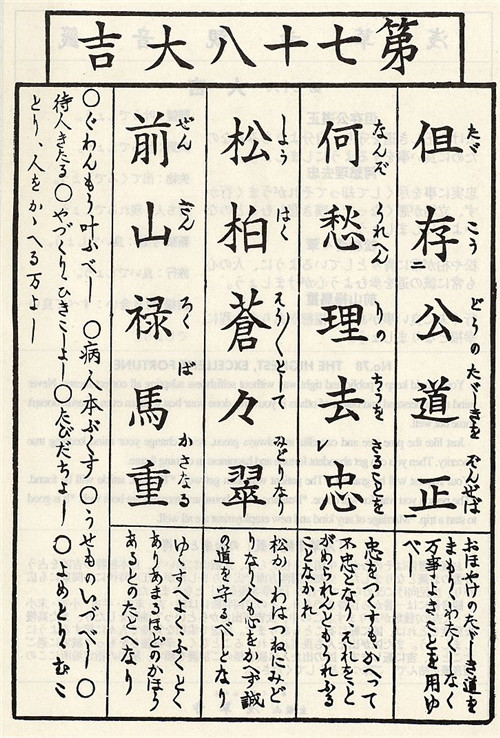
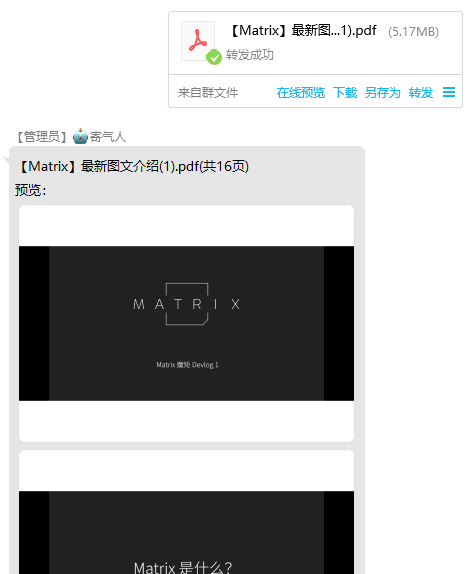
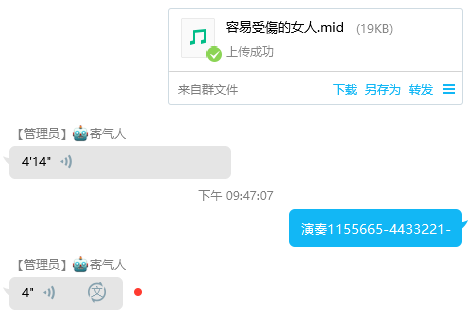

# 功能说明

这里放着的是目前已经写好的功能说明

建议看一看

现存功能

- [我吃啥](#我吃啥)
- [服务器信息](#服务器信息)
- [占卜](#占卜)
- [PDF自动转PNG](#PDF自动转PNG)
- [MIDI转语音](#MIDI转语音)

## 我吃啥

`wo_chi_sha`

每个群各自维护一份食物列表，当有人问`吃什么`，可随机得到一个食物。

> `发` 吃什么 新增 黄焖鸡
> 
> `收` 已新增 黄焖鸡
> 
> ---
> 
> `发` 我吃啥
> 
> `收` 红烧鱼
> 
> ---
> 
> `发` 有啥吃
> 
> `收` 红烧鱼 藤条焖猪肉 黄焖鸡

## 服务器信息

`server_info`

用于汇报挂这脚本的服务器的一些信息

可自己定制回复内容

我主要是用它来检测机器人是否在线并且没有被风控

> `发` 服务器信息
> 
> `收`
> ```
> 登录用户：QQ昵称(QQ号)
> 收发消息数：3189/349
> 操作系统：Windows 10.0.19044
> Python版本：3.10.1
> 系统内存使用率：62.3601%
> 脚本内存使用率：0.3753%
> 系统启动时长：2 days, 19:12:04
> 脚本运行时长：8:12:39
> ```

## 占卜

`zhan_bu`

`占卜`数据库文件：`zhan_bu.sql` 请自行导入数据库

支持 `求签` `解签` `挂签` 三个动作

> `发` 求签
> 
> `收` 你抽到了第七十八签。
> 
> 
> 
> ---
> 
> `发` 解签78
> 
> `收` 
> 
> ```
> 【第七十八签大吉】
> 
> 但存公道正
> 守着公共的正道，比起为了自己，更要为了大家做好事吧。
> 
> 何愁理去忠
> 忠实地尽心尽力做事，就算这样反而事情不能顺利进行、立场变坏也要当作没有悲伤叹息的事吧。
> 
> 松柏苍苍翠
> 就像松树或柏树经常青翠般地，人的心也要注意要经常走在诚恳的道路吧。
> 
> 前山禄马重
> 到最后会有好事，福德像是满出来般地变得幸福吧。
> 
> 愿望：会实现吧。
> 疾病：会治好吧。
> 遗失物：会出来吧。
> 盼望的人：会出现吧。
> 盖新居、搬家：好吧。
> 旅行：好吧。
> ```
> 
> ---
> 
> `发` 挂签
> 
> `收` 你已将签挂起。

## PDF自动转PNG

`pdf_to_png`

群里有人上传pdf文件时会自动生成预览



## MIDI转语音

`midi_to_record`

群里有人上传midi文件或有人触发指定关键词时会转换成语音

要求：安装`ffmpeg`与`fluidsynth`

下载音色库，放置于`functions/midi_to_record`目录下：

0. [SalamanderC5Light2.sf2](https://sites.google.com/view/hed-sounds/salamander-c5-light)

1. [MuseScore_General.sf2](ftp://ftp.osuosl.org/pub/musescore/soundfont/MuseScore_General/MuseScore_General.sf2)


说明详见[TextToMidi.py](../ay_advance/TextToMidi.py)

> 格式：多行文本，包括参数行与音符行。行内出现参数时则视为参数行，不解析音符。
> 
>   参数行：
> 
> - 调号：支持大调(1=)和小调(6=)记号，另支持低八度(末尾带2)或高八度(末尾带4)。
> 
>   示例：1=C，6=A，1=Bb，1=C2，1=C4。默认1=C。
> 
> - 节拍：数字+bpm。
> 
>   示例：140bpm。默认120。
> 
> 
>   音符行：01234567是八个音符，每个音符后面加符号来表示时值和音高。
> 
> - 音高：#:升半音，b:降半音，.:高八度，,:低八度。
> 
> - 时值：*:0.5拍，-:1拍，~:1.5拍，=:2拍，+:4拍，^:0.25拍(16分)，':0.125拍(32分)，默认0.5拍。
> 
> 
>   文本示例
> 
>   ```
>   6=B 138bpm
>   3571.753-2121253-
>   211-6,1432121253-
>   3571.753-2121253-
>   211-6-5-357771.2.7577=~66+
>   ```



1